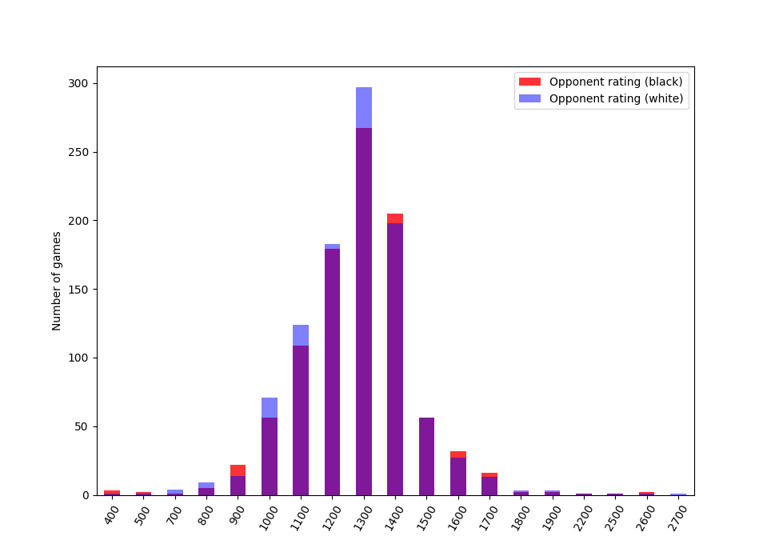
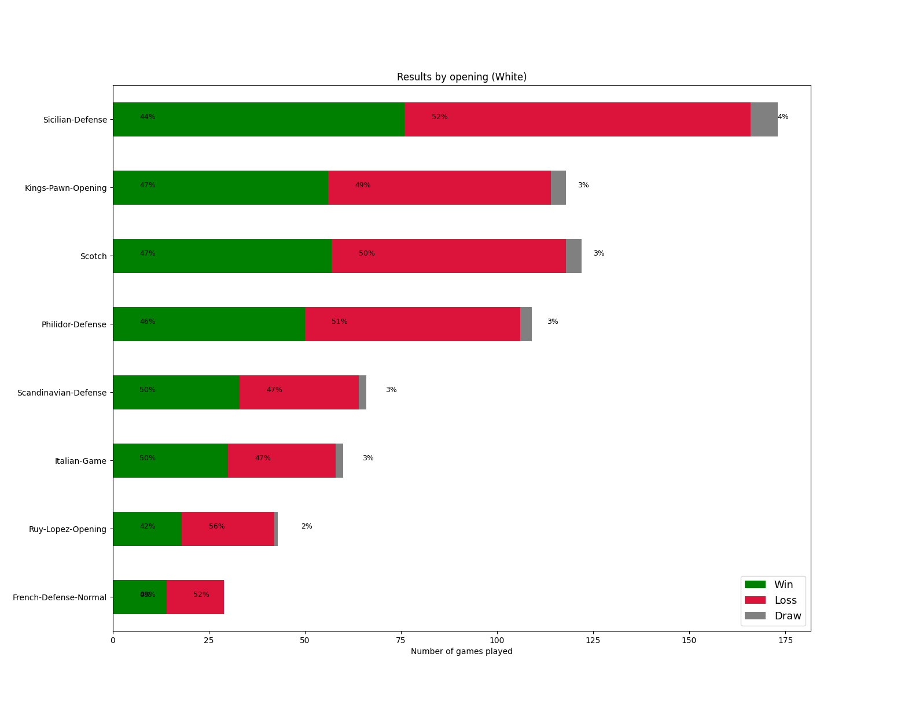
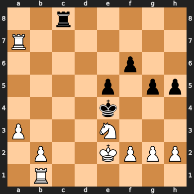

# Better Your Chess
### What for?
This project aims to help you learn from all the chess games you've played online, starting with a simple way to download an organized collection of your games! 

On Chess.com, you can view your winrate by color, your best win, and analyze a game per day for free. Building on top of the Stockfish engine and python-chess, this package aims to give the user: winrates by opening, automatic tactic generation from your library, and common deviations from book moves.

Current features:
- winrate by opening 
- rating distribution 

In progress:
- automatic tactics generation from your library

Future features:
- show opening positions where you often deviate from book moves
- loss frequencies (checkmate, resignation, timed out)
- suggest grandmasters with similar repertoires

### Components

1. **notebooks/intro_to_python-chess.ipynb** -  intro to working with PGNs via python-chess and polyglot opening books.

2. **scripts/pgn_downloader.py** - download Chess.com games for a user, organized in year/month directories.
    ```
    python scripts/pgn_downloader.py username
    ```

3. **chess_analytics/game_reader.py** - implements a GameReader, class to work with PGNs.

4. **chess_analytics/game_library.py** - build a library of games from a directory, represented as a dataframe with 1 row per game.
    ```
    from chess_analytics.game_library import GameLibrary
    library = GameLibrary("data/user_games/user/")
    library.df.head()
    ```
    

5. **scripts/plotting.py** - visualize a library: opponent rating distribution, winrate by opening, and more.
<p align="center">
    
    
</p>

6. **scripts/generate_tactics.py** - Automatically generate tactics from a library. This currently supports mate-in-Ns, producing a JSON and PNGs of the positions. 10 examples are in *data/output/tactics/*.

<p align="center">
    
</p>
    <p align="center">White to move & mate in two</p>


### Sources

- [python-chess](https://python-chess.readthedocs.io/en/latest/#)
- [Stockfish](https://pypi.org/project/stockfish/)
- [Chess.com API](https://www.chess.com/club/chess-com-developer-community)
- [Opera Game PGN](https://www.chessgames.com/perl/chessgame?gid=1233404) (Paul Morphy vs. Duke of Brunswick and Count Isouard, 1958)
- [Polyglot opening book - Marc Lacrosse](https://github.com/niklasf/python-chess/raw/master/data/polyglot/performance.bin)
- [Encyclopedia of Chess Openings](https://github.com/seberg/icsbot/blob/master/misc/eco.txt)