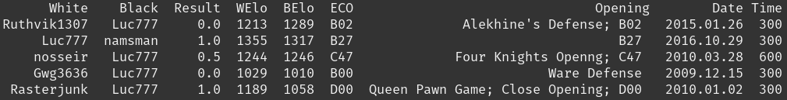
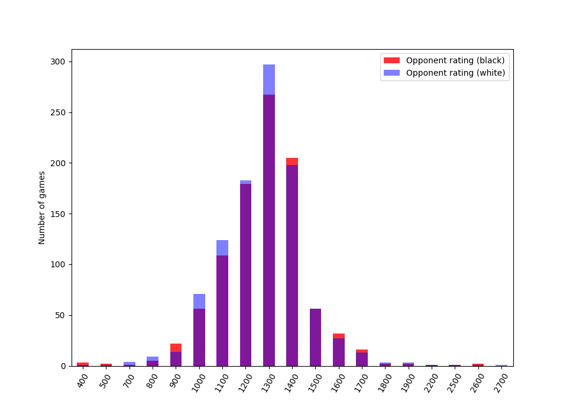
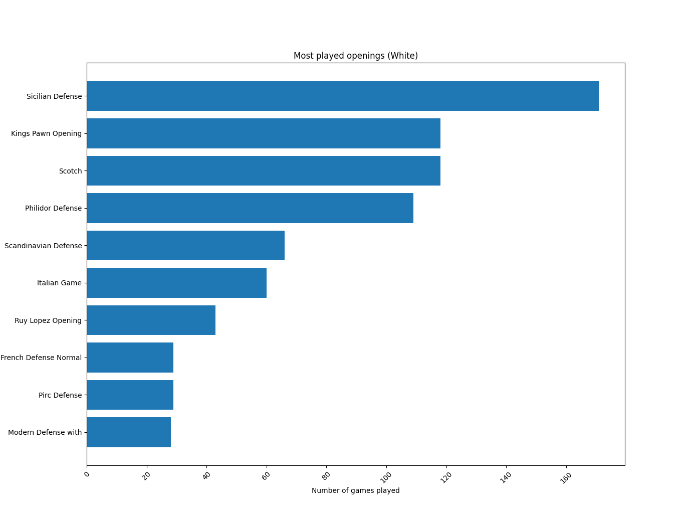

# chess_analytics
### What for?
This project aims to give a high-level analysis of large amounts of chess games, starting with a simple way to download an organized collection of all your Chess.com games! 

On Chess.com, players can view simple statistics about their games, like win-rate by color and best win. They can also analyze a couple games per day for free. This package aims to go a bit further, without requiring much work from the player.

Examples: 
- winrate by opening
- loss-type frequencies (checkmate, resignation, out of time)
- visualizations, e.g. a heatmap of the user's chess position by move 
- grandmasters who have a similar repertoire, so you can study them

### Components

1. **notebooks/intro_to_python-chess.ipynb** -  working with python-chess on any PGN (game) and interfacing with polyglot opening books.

2. **scripts/pgn_downloader.py** - a script to download all chess.com games for a user, organized in year/month directories.
    ```
    python scripts/pgn_downloader.py username
    ```

3. **chess_analytics/game_reader.py** - implements a GameReader class to work with PGNs.

4. **chess_analytics/game_library.py** - create a library of games from a directory, represented as a dataframe with a row per game.
    ```
    from chess_analytics.game_library import GameLibrary
    library = GameLibrary("data/user_games/user/")
    print(len(library.df))
    ```
    ```
    >> 1969
    ```
    ```
    library.df.head()
    ```
    

5. **scripts/plotting.py** - visualize a library of games - opponent rating distribution, most common openings
<p align="center">
    
    
</p>

### Sources

- [python-chess](https://python-chess.readthedocs.io/en/latest/#)
- [Chess.com API](https://www.chess.com/club/chess-com-developer-community)
- [Opera Game PGN](https://www.chessgames.com/perl/chessgame?gid=1233404) (Paul Morphy vs. Duke of Brunswick and Count Isouard, 1958)
- [Polyglot opening book](https://github.com/niklasf/python-chess/raw/master/data/polyglot/performance.bin)
- [Encyclopedia of Chess Openings](https://github.com/seberg/icsbot/blob/master/misc/eco.txt)